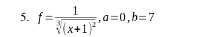
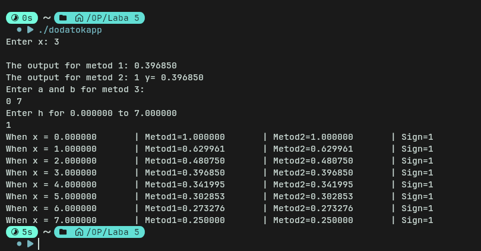

## МІНІСТЕРСТВО ОСВІТИ І НАУКИ УКРАЇНИ

**НАЦІОНАЛЬНИЙ УНІВЕРСИТЕТ \"ЛЬВІВСЬКА ПОЛІТЕХНІКА\"**

Інститут **ІКНІ**

Кафедра **ПЗ**

ЗВІТ

> До лабораторної роботи № 1

**На тему:** Основи роботи з функціями в С*\
***З дисципліни:***"Основи програмування"*

**Лектор:**

ст.викл. каф. ПЗ

Тарас МУХА

**Виконала:**

ст. гр. ПЗ-11

Максим КОНОПЛІН

**Прийняла:**

ст.викл. каф. ПЗ

Лілія ДЯКОНЮК

« » 2025 р.

∑= [.]{.underline}

> Львів -- 2025

**Тема роботи:** Основи роботи з функціями в С

**Мета роботи:** Навчитися створювати, та використовувати функції в С

#  Завдання з додатку №1

Протабулювати, задану згідно варіанту функцію, на проміжку \[a , b\] з
кроком h двома

способами.

Для обчислення значення, заданої згідно варіанту функції y в точці x ∈
\[a , b \]:

1\) першим способом: оголосити і реалізувати функцію мовою С, формальним

параметром якої є x, а результатом функції є значення y;

2\) другим способом: оголосити і реалізувати функцію мовою С, першим

формальними параметром функції є x, другим формальним параметром є
аргумент,

куди буде повернено результат обчислення за формулою. Функція повертає:

−1 , якщо y \<0 ;

0, якщо y=0 ;

1, якщо y \> 0.

Табуляцію оформити у вигляді окремої функції. Результати обчислень
подати у

вигляді таблиці.

Всі функції розмістити в заголовному файлі.

{width="3.5625in"
height="0.6354166666666666in"}

# Код додатку №1

#include \<stdio.h\>

#include \<math.h\>

double calculate_1 (double x);

int calculate_2 (double x, double \*result_of_metod2);

void calculate_tabl (double h, double a, double b);

double calculate_1 (double x){

double square;

square = (x+1)\*(x+1);

double root = cbrt (square);

double result = 1 / root;

return result;

}

int calculate_2 (double x, double \*result_of_metod2){

double result = calculate_1 (x);

\*result_of_metod2 = result;

if (result \< 0){

return -1;

}

if (result == 0){

return 0;

}

if (result \> 0){

return 1;

}

}

void calculate_tabl (double h, double a, double b){

for (double i = a; i \<= b; i=i+h){

if (i == -1){

printf (\"\\nError when x = -1\\n\");

return;

}

double result_metod1 = calculate_1(i);

double y_from_metod2;

int sign_metod2 = calculate_2 (i, &y_from_metod2);

printf (\"When x = %f\\t\| Metod1=%f\\t\| Metod2=%f\\t\| Sign=%d\\n\",
i, result_metod1, y_from_metod2, sign_metod2);

}

}

int main () {

double x;

printf (\"Enter x:\");

scanf(\"%lf\", &x);

if (x == -1){

printf (\"Error, you resived 0\\a\");

return 1;

}

double metod_1 = calculate_1 (x);

printf (\"\\nThe output for metod 1: %f\", metod_1);

double y_from_metod2;

int metod_2 = calculate_2 (x, &y_from_metod2);

printf ( \"\\nThe output for metod 2: %d y= %f\", metod_2,
y_from_metod2);

printf (\"\\nEnter a and b for metod 3:\\n\");

double a , b , h ;

scanf (\"%lf %lf\", &a, &b);

printf (\"Enter h for %f to %f\\n\", a, b);

scanf (\"%lf\", &h);

calculate_tabl (h, a, b);

return 0;

}

**Результат виконання додатку №1**

# {width="7.087160979877515in" height="3.6944444444444446in"} 

# 

# 

#  **Висновки:**

Здобуто навичок користування функціями у мові С.

**\
**

#      

.
